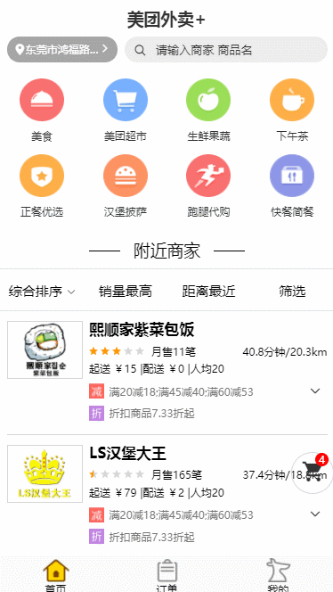
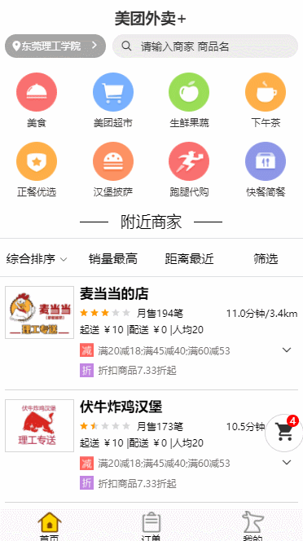
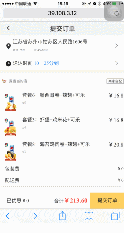
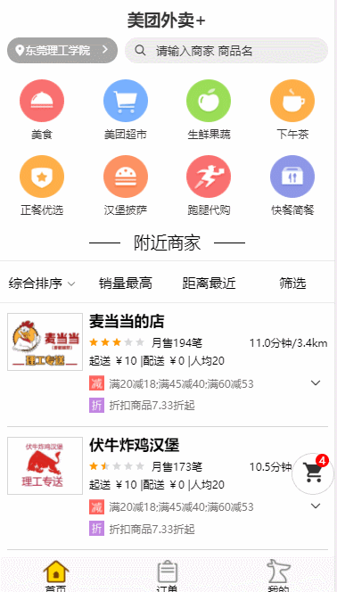
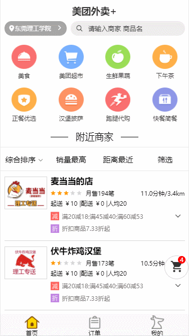

## 更新（2019/6/5） ##
项目已经发布一年多的时间，vue-cli已经升级到3.0，很多依赖也都更新了导致项目跑不起来，这里简单的把项目升级到vue-cli3版本，接下来准备发布小程序版本的，感谢大家的支持。

## 关于 ##
2019届大三学生，前段时间一直想一个人单独开发一个较为完整的项目，在众多应用中，考虑之后选择了美团外卖来模仿，这段时间就利用课余时间进行开发，前端用vue+vuex+vue-router+axios，因为需要用到定位和支付等功能，需要后端配合，而且想要做真正数据交互，所以用express(基于nodejs的框架)做后台，数据库用NOSQL的mongodb。 前端项目包含20多个路由，涉及到vue文件有40个，功能设计登录，定位，浏览商品，加购物车，下订单，支付(支持微信和支付宝的扫码支付和调起app支付)，评价，个人信息更改，是一个较为完整的项目。

### 注意：此项目为个人开发实践练习，不作为任何商业用途


## 社区地址
   掘金地址：>[https://juejin.im/post/5aca46e2f265da238c3af4ca](https://juejin.im/post/5aca46e2f265da238c3af4ca)

   思否地址：>[https://segmentfault.com/a/1190000014267516?utm_source=index-hottest](https://segmentfault.com/a/1190000014267516?utm_source=index-hottest)
## 功能 ##
- 登录/注销
- IP定位
- 搜索地址
- 获取商店(计算当前位置和商店的距离)
- 加购物车
- 下订单
- 支付(支持微信和支付宝的扫码支付和调起app支付)
- 评价
- 头像上传(用了七牛云存储)
- 图片懒加载


## 技术栈 ##
- Webpack-cli搭建项目
- Vue全家桶(vue+vuex+vue-router)
- CSS预处理器SCSS
- axios与后端进行请求数据
- 七牛云存储图片
- 支付宝和微信支付
- 使用better-scroll滚动
- Express搭建后端服务
- Mongoose对MongoDB进行便捷操作
- 使用Charles抓取数据


## 效果演示
### 主界面 ###

### 定位和搜索 ###

### 扫码支付 ###

### APP支付 ###

### 我的购物车 ###

### 清除购物车 ###

### 评论 ###

### 其它 ###

### 还有一些其它功能就不放图了哈 ###

## 线上地址 ##
    http://39.108.3.12
    请用谷歌浏览器然后开启移动端浏览，如果要调用APP支付就需要用手机自带浏览器打开，然后支付时选择调起APP支付

## 说明
    后端项目地址：>[GitHub：https://github.com/zwStar/meituan-backend](https://github.com/zwStar/meituan-backend)

## 未完待续 ##
    还有商家管理PC端还没写完，等写完再开源出来

## 项目部署

阿里云 CentOS 7.4 64位

## 项目运行

```
项目运行之前，请确保系统已经安装以下应用
1、node
2、mongodb
```

```
git clone https://github.com/zwStar/vue-meituan.git

cd vue-meituan

npm install

npm run dev

访问: http://localhost:8080 (确保后端项目服务已开启)

```

# 项目布局

```
.
├── api                             后端接口
├── config.js                       运行配置
├── assets                          静态资源
├── components                      全局组件
├── router                          路由
├── store                           vuex
├── styles                          全局样式
├── views                           页面
├── App.vue                         入口页面
├── main.js                         入口
├── .babelrc                        babel-loader 配置
├── .gitignore                      git 忽略项
├── favicon.ico                     favicon图标
├── index.html                      html模板
└── package.json                    package.json
.

```


## 写在最后 ##
因为还是学生，平时最多也是和同学一起开发，并没有参与过真正的企业团队开发，所以应该有很多地方做的不是很好，欢迎各位大佬们给我提一些意见。

 如果有问题，您可以在 Issues 中提问哈。
 如果您对这个项目感兴趣，请Star支持下，谢谢！
# License
    MIT

# 打赏
如果觉得这个项目对你有帮忙，可以请我喝杯奶茶哈


